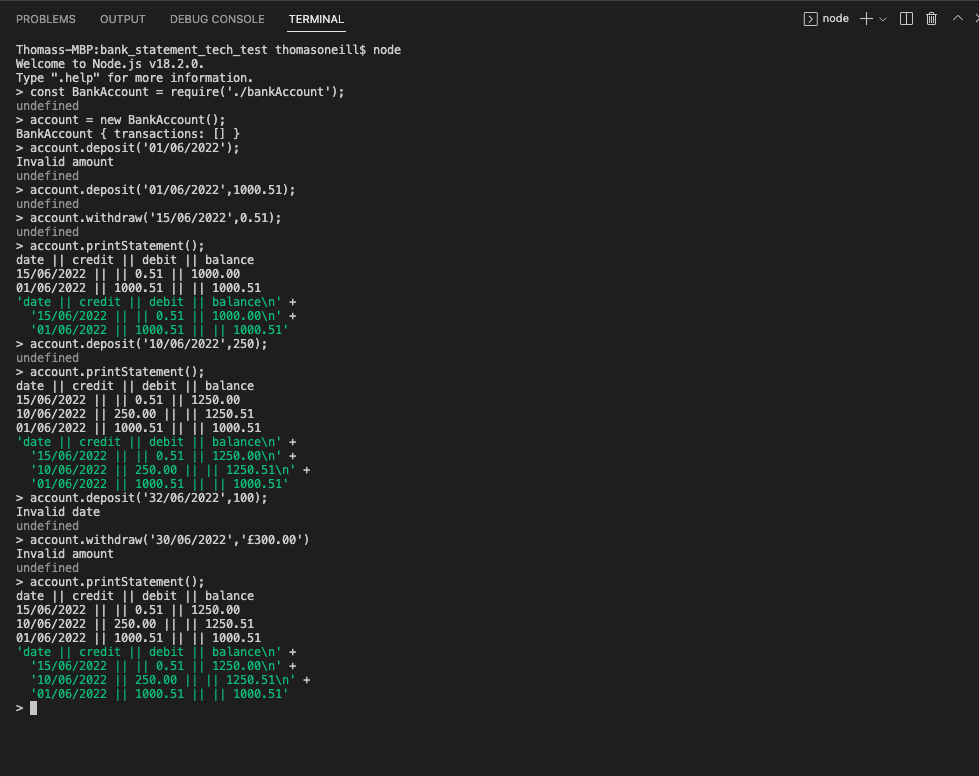

# Bank Statement Tech Test

## Set up instructions

```
git clone https://github.com/tomoneill32/bank_statement_tech_test.git
cd bank_statement_tech_test
npm install
node
```
----
## Usage instructions

From the directory, initiate node with 
``` 
node
```

Within node

```
const BankAccount = require('./bankAccount');
```

You can then create an account, deposit money in, withdraw money and view a bank statement. For example:

```
const account = new BankAccount();
account.deposit('25/06/2022',600);
account.withdraw('26/06/2022',100);
account.printStatement();
```

The bank statement will be printed to the console, ordered in reverse order by transaction date and the correct balance on each transaction regardless of the order in which the transactions were created. 

To deposit and withdraw, a date must be given along with an amount. The date should be passed as a string in the format 'dd/mm/yyyy', the amount deposited/withdrawn as a number, if the date format is incorrect or the amount given is not a number the transaction will not be added and a message will be passed to the console.



---

## Tests

Within the directory, tests can be run with 

```
jest
```

To get test coverage:

```
jest --collect-coverage
```

---

## Approach

This program was written through test driven development. Initially the simplest possible test was to get a bank statement with no transactions. Further complexity was added through one deposit followed by two deposits. I followed a pretty rigourous TDD process here, hardcoding the responses initially before writing a second test to require code that read the amount deposited. 

With two deposits, this required calculating the balance in the account after each transaction had been made. This was done with a method that iterates over the array of transactions with a running balance that was assigned to transaction.balance. The transactions were stored as an instance variable on the BankAccount class in an array of objects, each object having a date, credit amount and balance. By this stage the code was somewhat longer and I split the transactions out as a separate class rather than just an array of objects within BankAccount.

Shortly afterwards I fulfilled the most basic brief, requirements below, three transactions entered in date order, two deposits and one withdrawal. The withdrawal did not add much complexity, it was very similar to the deposit.

Further refactoring from here involved splitting the statement itself away from the BankAccount class. All reformatting of the transactions to a string to display on the statement was done from within the bankStatement file. The BankAccount class only handled deposits, withdrawals, and calculating the balance after each transaction.

The first edge case I considered was if the dates were entered in the incorrect order. They would be presented in the order they were entered in, consequently the balance on a specific date would not be correct. I fixed this by having the transaction date saved as a Date object rather than a string. The transactions could then be sorted after each deposit/withdrawal and the correct balance calculated. Converting the string to a date object was not too much trouble but reformatting the date object to a string for the bank statement proved to be more fiddly, I had to include an extra method to format single digit numbers as '01' rather than 1.

By this stage there were a lot of lines of code in the bankStatement file. The method for reformatting the bank transactions to a long string to be printed to the console was quite long. I decided that the reformatting process should be split into two. The reformatting for each transaction was moved to the Transaction class, and only the joining together and reversing of each reformatted transaction done by the BankStatement class. This made the testing process easier as I could mock the output of the reformatted bank transaction for my BankStatement unit tests and have separate unit tests for the Transaction class.

The other edge case I considered was for validating that the inputs for deposits and withdrawals were correct. There are extra methods that check if the date is a valid date and amounts are valid numbers. If they are not, the transaction is not added and a message is displayed in the console. 

After passing each test I refactored the code, this is where the class splitting previously mentioned was done. Additionaly refactoring was largely shortening methods down, specifically to try and maintain the single responsibility principle. I could have saved time on refactoring by better planning for each class and their respective responsibilities from the start. 

One last point, on the printStatement method. I was confused initially on how to test stdout with jest. Research on the internet was proving fruitless and I didn't wan't to spend too much time on it as I don't think it was a key requirement of the spec. The tests test for the value returned by this method, which is one long string. The method also prints this string to the console, the \n elements at the beginning of each transaction do indeed begin a new line when the string is printed, but the tests themselves test the value returned by the method, not what is displayed on the console, though they are the same value: BankStatement.statement.


## Specification

### Requirements

* You should be able to interact with your code via a REPL like IRB or Node.  (You don't need to implement a command line interface that takes input from STDIN.)
* Deposits, withdrawal.
* Account statement (date, amount, balance) printing.
* Data can be kept in memory (it doesn't need to be stored to a database or anything).

### Acceptance criteria

**Given** a client makes a deposit of 1000 on 10-01-2023  
**And** a deposit of 2000 on 13-01-2023  
**And** a withdrawal of 500 on 14-01-2023  
**When** she prints her bank statement  
**Then** she would see

```
date || credit || debit || balance
14/01/2023 || || 500.00 || 2500.00
13/01/2023 || 2000.00 || || 3000.00
10/01/2023 || 1000.00 || || 1000.00
```
